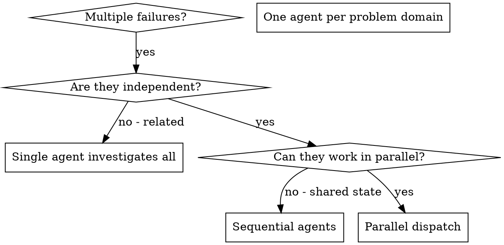

# Dispatching Parallel Agents (TiBot 定制版)

> 在原版 superpowers/dispatching-parallel-agents 基础上, 叠加 TiBot 项目规则

## TiBot 项目背景
- 4 个项目 agent (派发执行者):
  - `orchestrator` (主调度) — 唯一派发口
  - `android-coder` (写代码) — 实施 TDD 写代码
  - `android-review` (审查) — spec 合规 + 质量审查
  - `android-build` (CI 分析, **ask 权限** = 派发前需用户确认) — 监控 CI / 拉 logs
- 多 agent 派发计划参考: 见 `docs/superpowers/plans/` 中多 agent 派发计划 §2 (文件冲突矩阵)
- 当前版本: versionCode=37, versionName="2.2.2"
- CLAUDE.md 硬性规则: 禁止本地 gradle, 直推 main, 不开 PR, **每次改动递增 versionCode**

## TiBot 化改动点 vs 原版
1. **文件冲突矩阵** (新增必填, 决定串/并行) — 同一文件被多 agent 改 → **串行**
2. **派发指令必含** (原版无, 项目硬性):
   - 目标文件清单 (target_files)
   - 禁止文件清单 (forbidden_files, 防越界)
   - 验收标准 (acceptance_criteria, 可测量)
   - 关联 spec 路径
   - **version bump 提醒** (CLAUDE.md 硬性)
3. **CI 任务 ask 权限** (android-build 需要用户确认 — CI 触发可能消耗 GitHub Actions minutes)
4. **派发前必列矩阵** (防 改同一文件冲突 — 通用原则)
5. **强引用 4 个项目 agent** (原版用 generic "subagent", 本项目已固定 4 个具名 agent)
6. **不接受原版 "Multiple dispatch calls in one response"** — 在 TiBot 中派发全部由 `orchestrator` agent 通过 `task` 工具统一发起, 不在主 session 内联

---

---
name: dispatching-parallel-agents
description: Use when facing 2+ independent tasks that can be worked on without shared state or sequential dependencies
---

# Dispatching Parallel Agents

## Overview

You delegate tasks to specialized agents with isolated context. By precisely crafting their instructions and context, you ensure they stay focused and succeed at their task. They should never inherit your session's context or history — you construct exactly what they need. This also preserves your own context for coordination work.

When you have multiple unrelated failures (different test files, different subsystems, different bugs), investigating them sequentially wastes time. Each investigation is independent and can happen in parallel.

**Core principle:** Dispatch one agent per independent problem domain. Let them work concurrently.

## When to Use



**Use when:**
- 3+ test files failing with different root causes
- Multiple subsystems broken independently
- Each problem can be understood without context from others
- No shared state between investigations

**Don't use when:**
- Failures are related (fix one might fix others)
- Need to understand full system state
- Agents would interfere with each other

## The Pattern

### 1. Identify Independent Domains

Group failures by what's broken:
- File A tests: Tool approval flow
- File B tests: Batch completion behavior
- File C tests: Abort functionality

Each domain is independent - fixing tool approval doesn't affect abort tests.

### 2. Create Focused Agent Tasks

Each agent gets:
- **Specific scope:** One test file or subsystem
- **Clear goal:** Make these tests pass
- **Constraints:** Don't change other code
- **Expected output:** Summary of what you found and fixed

### 3. Dispatch in Parallel

Issue all three subagent dispatches in the same response — they run in parallel:

```text
Subagent (general-purpose): "Fix agent-tool-abort.test.ts failures"
Subagent (general-purpose): "Fix batch-completion-behavior.test.ts failures"
Subagent (general-purpose): "Fix tool-approval-race-conditions.test.ts failures"
# All three run concurrently.
```

Multiple dispatch calls in one response = parallel execution. One per response = sequential.

### 4. Review and Integrate

When agents return:
- Read each summary
- Verify fixes don't conflict
- Run full test suite
- Integrate all changes

## Agent Prompt Structure

Good agent prompts are:
1. **Focused** - One clear problem domain
2. **Self-contained** - All context needed to understand the problem
3. **Specific about output** - What should the agent return?

```markdown
Fix the 3 failing tests in src/agents/agent-tool-abort.test.ts:

1. "should abort tool with partial output capture" - expects 'interrupted at' in message
2. "should handle mixed completed and aborted tools" - fast tool aborted instead of completed
3. "should properly track pendingToolCount" - expects 3 results but gets 0

These are timing/race condition issues. Your task:

1. Read the test file and understand what each test verifies
2. Identify root cause - timing issues or actual bugs?
3. Fix by:
   - Replacing arbitrary timeouts with event-based waiting
   - Fixing bugs in abort implementation if found
   - Adjusting test expectations if testing changed behavior

Do NOT just increase timeouts - find the real issue.

Return: Summary of what you found and what you fixed.
```

## Common Mistakes

**❌ Too broad:** "Fix all the tests" - agent gets lost
**✅ Specific:** "Fix agent-tool-abort.test.ts" - focused scope

**❌ No context:** "Fix the race condition" - agent doesn't know where
**✅ Context:** Paste the error messages and test names

**❌ No constraints:** Agent might refactor everything
**✅ Constraints:** "Do NOT change production code" or "Fix tests only"

**❌ Vague output:** "Fix it" - you don't know what changed
**✅ Specific:** "Return summary of root cause and changes"

## When NOT to Use

**Related failures:** Fixing one might fix others - investigate together first
**Need full context:** Understanding requires seeing entire system
**Exploratory debugging:** You don't know what's broken yet
**Shared state:** Agents would interfere (editing same files, using same resources)

## Real Example from Session

**Scenario:** 6 test failures across 3 files after major refactoring

**Failures:**
- agent-tool-abort.test.ts: 3 failures (timing issues)
- batch-completion-behavior.test.ts: 2 failures (tools not executing)
- tool-approval-race-conditions.test.ts: 1 failure (execution count = 0)

**Decision:** Independent domains - abort logic separate from batch completion separate from race conditions

**Dispatch:**
```
Agent 1 → Fix agent-tool-abort.test.ts
Agent 2 → Fix batch-completion-behavior.test.ts
Agent 3 → Fix tool-approval-race-conditions.test.ts
```

**Results:**
- Agent 1: Replaced timeouts with event-based waiting
- Agent 2: Fixed event structure bug (threadId in wrong place)
- Agent 3: Added wait for async tool execution to complete

**Integration:** All fixes independent, no conflicts, full suite green

**Time saved:** 3 problems solved in parallel vs sequentially

## Key Benefits

1. **Parallelization** - Multiple investigations happen simultaneously
2. **Focus** - Each agent has narrow scope, less context to track
3. **Independence** - Agents don't interfere with each other
4. **Speed** - 3 problems solved in time of 1

## Verification

After agents return:
1. **Review each summary** - Understand what changed
2. **Check for conflicts** - Did agents edit same code?
3. **Run full suite** - Verify all fixes work together
4. **Spot check** - Agents can make systematic errors

## Real-World Impact

From debugging session (2025-10-03):
- 6 failures across 3 files
- 3 agents dispatched in parallel
- All investigations completed concurrently
- All fixes integrated successfully
- Zero conflicts between agent changes

---

## TiBot 派发矩阵模板（必填）

派发前, **必**列出所有 subagent 的目标文件, 形成矩阵 (参考 多 agent 派发计划 §2):

| agent | MainAct | NavH | TopB | Input | Screens | VM | BotCl | Upd | Store | ... |
|------|---------|------|------|-------|---------|----|----|----|---|---|
| 1    | ✏️      | ✏️   | —    | —     | ✏️      | —  | —    | —  | —  | ... |
| 2    | —       | —    | —    | —     | —        | ✏️ | ✏️   | ✏️ | ✏️ | ... |
| 3    | —       | —    | ✏️   | —     | ✏️      | —  | —    | —  | —  | ... |

**判定规则** (项目硬性):
- 同一文件被多个 改 → **串行** (后一个等前一个 CI 绿)
- 不同文件 → 可**并行** (但仍由 orchestrator 派发)
- 互相无依赖 → 完全并行
- ❌ **禁止**主 session 内联派发 (绕过 orchestrator)

## 派发指令模板（每个 subagent 必填）

每个派发给 `android-coder` / `android-review` / `android-build` 的指令, **必**含:

```yaml
target_files: [绝对路径列表]
forbidden_files: [其他 subagent 改的文件, 防越界]
acceptance_criteria:
  - <可测量的标准 1>
  - <可测量的标准 2>
related_spec: docs/superpowers/specs/...
version_bump_reminder: true  # CLAUDE.md 硬性, 每次改动必做
agent_model: <model-id>  # 显式指定, 不继承 session
ci_required: true  # 改完必走 CI, 禁本地 gradle
```

**示例** (android-coder):

```yaml
agent: android-coder
model: <model-id>
target_files:
  - app/src/main/java/com/faster/tibot/ui/chat/ChatScreen.kt
  - app/src/main/java/com/faster/tibot/ui/chat/Bubble.kt
forbidden_files:
  - app/src/main/java/com/faster/tibot/ui/chat/MainActivity.kt  # agent 2 改
  - app/src/main/java/com/faster/tibot/data/Store.kt
acceptance_criteria:
  - 气泡宽度自适应内容, 不再固定 max
  - 添加 unit test 覆盖 Bubble 宽度计算
  - Compose preview 渲染正确
related_spec: docs/superpowers/specs/2026-06-21-bubble-width-design.md
version_bump_reminder: true
ci_required: true
```

## 与项目 agent 互调

- **派发统一口** → 由 `orchestrator` agent 调用 `task` 工具派发 (不在主 session 内联)
- **android-coder** → 写代码, 实施 TDD + systematic-debugging
- **android-review** → 审查 spec 合规 + 质量
- **android-build** (**ask 权限**) → 派发前需用户确认 (CI 触发有成本)
- **审查/收尾链** → android-review → orchestrator → finishing-a-development-branch

## 关键防错点

- ❌ **不要**跳过文件冲突矩阵 → 派发前必填, 防 改同一文件
- ❌ **不要**让主 session 内联派发 → 一律走 orchestrator
- ❌ **不要**漏 `target_files` / `forbidden_files` → 防 越界
- ❌ **不要**漏 `version_bump_reminder: true` → CLAUDE.md 硬性
- ❌ **不要**让 android-build 自动触发 → 必须用户确认
- ✅ **每个派发指令**必含 5 字段: target_files / forbidden_files / acceptance_criteria / related_spec / version_bump_reminder
